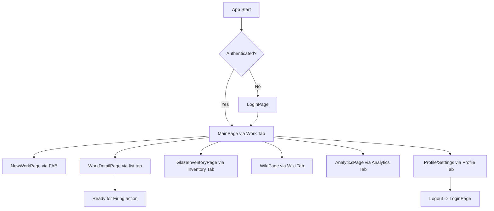

# UI Implementation Plan – PottMaster (.NET MAUI)

## 1. Overview

This plan outlines the step-by-step approach for implementing the PottMaster MVP UI in .NET MAUI, based on the user stories and design guidelines. The focus is on modularity, localization, offline-first UX, and clear status feedback.

---

## 2. General Principles

- **MVVM Pattern**: Use ViewModels for all pages.
- **Localization**: All UI text via RESX files.
- **Accessibility**: Ensure color contrast, font scaling, and screen reader support.
- **Responsive Layout**: Use MAUI layouts for adaptive design (mobile/tablet/desktop).
- **Offline-First**: UI must not block on network; show sync status.
- Icons from https://www.svgrepo.com/collection/responsive-flat-icons/
---

## 3. Page-by-Page Implementation (Status)

### 3.1 Authentication & User Management

- **LoginPage** *(Done)*
  - Email/password fields, "Sign in with Google/Apple" buttons.
  - Error and loading states.
  - Link to SignupPage.
- **SignupPage** *(Done)*
  - Registration form (email, password, confirm).
  - Validation and error feedback.
- **Profile/Settings** *(Not Started)*
  - Display initials, allow logout, language selection.

### 3.2 Work Lifecycle Management

- **MainPage (Work List)** *(Done)*
  - List of works with status, photo, countdown timer.
  - "Add New Work" FAB/button.
- **NewWorkPage** *(Done)*
  - Photo capture/upload, category picker, wall thickness slider.
  - Save button, validation.
- **WorkDetailPage** *(Done)*
  - Show unique code, drying timer, status progression.
  - "Ready for Firing" button with confirmation dialog.

### 3.3 Material & Inventory Management

- **GlazeInventoryPage** *(Not Started)*
  - List of glazes, add/edit glaze dialog.
  - Link glazes to works.

### 3.4 Knowledge Base (Wiki)

- **WikiPage** *(Not Started)*
  - Search bar, list of materials/tools.
  - Detail view with trust tags.

### 3.5 Analytics & Reporting

- **AnalyticsPage** *(Not Started)*
  - Monthly summary, pie chart (MAUI Graphics), yield rate.
  - Share/export report.

### 3.6 Offline & Synchronization

- **SyncStatusIndicator** *(Not Started)*
  - Global component in AppShell.
  - Shows sync state (pending, syncing, error, up-to-date).

---

## 4. Navigation Structure

### 4.1 Main Navigation
- **Bottom Tab Bar**: The app uses a bottom tab bar for main navigation, with icons for each section.
  - **Work Tab**: Leads to MainPage (Work List).
  - **Inventory Tab**: Leads to GlazeInventoryPage.
  - **Wiki Tab**: Leads to WikiPage.
  - **Analytics Tab**: Leads to AnalyticsPage.
  - **Profile Tab**: Leads to Profile/Settings page.

### 4.2 Page-Specific Navigation and Buttons
- **LoginPage**: "Sign in with Google/Apple" buttons, link to SignupPage.
- **SignupPage**: Back to LoginPage, save button.
- **MainPage**: FAB "Add New Work" button, list items tap to navigate to WorkDetailPage.
- **NewWorkPage**: Save button, back navigation.
- **WorkDetailPage**: "Ready for Firing" button with confirmation dialog, back navigation.
- **GlazeInventoryPage**: Add/Edit buttons, back navigation.
- **WikiPage**: Search bar, list items tap to detail view.
- **AnalyticsPage**: Share/Export buttons.
- **Profile/Settings**: Logout button, language selector.

### 4.3 Back Navigation
- Use swipe gestures for back navigation on all pages.
- Standard back button in navigation bar where applicable.

### 4.4 Conditional Navigation
- If user is not authenticated, redirect to LoginPage.
- No role-based tab visibility; all tabs available to authenticated users.

### 4.5 Navigation Flow Diagram

---

## 5. Cross-Cutting Features (Status)

- **Localization** *(In Progress)*
  - All UI strings in `AppResources.resx` and `AppResources.en.resx`.
  - Language selector in settings. *(Not Started)*
- **Theming** *(In Progress)*
  - Use `Styles.xaml` for colors, fonts, and spacing.
  - Follow Material Design 3 guidelines for Android, with a style similar to the Reply app: clean, modern interface emphasizing typography, subtle shadows, and intuitive navigation. Ensure consistency across all pages and components.
- **Dialogs & Toasts** *(Not Started)*
  - Use MAUI Community Toolkit for dialogs, confirmations, and error toasts.

---

## 6. Implementation Sequence (with Status)

1. **Authentication UI**: LoginPage *(Done)*, SignupPage *(Done)*, Profile/Settings *(Not Started)*.
2. **Work Management**: MainPage *(Done)*, NewWorkPage *(Done)*, WorkDetailPage *(Done)*.
3. **Navigation Setup**: Implement bottom tab bar and navigation logic *(Not Started)*.
4. **Offline/Sync Indicator**: SyncStatusIndicator *(Not Started)*.
5. **Glaze Inventory**: GlazeInventoryPage *(Not Started)*.
6. **Wiki**: WikiPage *(Not Started)*.
7. **Analytics**: AnalyticsPage *(Not Started)*.
8. **Localization**: Integrate RESX *(In Progress)*, language selector *(Not Started)*.
9. **Polish & Accessibility**: Theming *(In Progress)*, accessibility, responsive tweaks *(Not Started)*.

---

## 7. UI Component Reuse

- **Custom Controls**: Status badge, countdown timer, photo thumbnail, sync indicator.
- **Data Templates**: For lists (works, glazes, wiki entries).

---

## 8. Testing & Review

- **Manual UI walkthroughs** for each user story.
- **Localization checks** for all supported languages.
- **Offline/online scenario testing**.
- **Accessibility review**.

---

## 9. References

- [User Stories Reference](../.kilocode/rules/memory-bank/user-stories.md)
- [MAUI UI Guidelines](../.kilocode/rules/maui-guidelines.md)
- [AppResources.resx](../Resources/AppResources.resx)

---

**Last updated:** 2026-01-01

---

**Status Legend:**
- *(Done)*: Implemented and available in codebase
- *(In Progress)*: Partially implemented or under development
- *(Not Started)*: No implementation yet